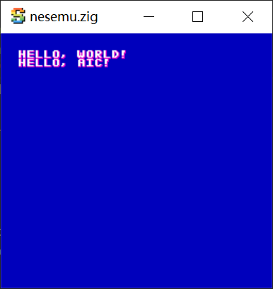
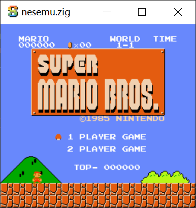
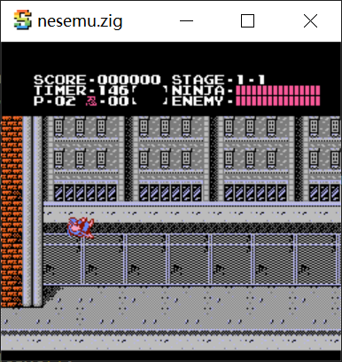

# nesemu.zig

NES emulator using zig (with sokol and agnes)

This is my hobby project for learning zig.

```bash
# using zig 0.14.0
$ zig build run
```

# screenshots

<p align="center">
  
  
  
</p>

# links

- https://github.com/floooh/sokol-zig
- https://github.com/kgabis/agnes
